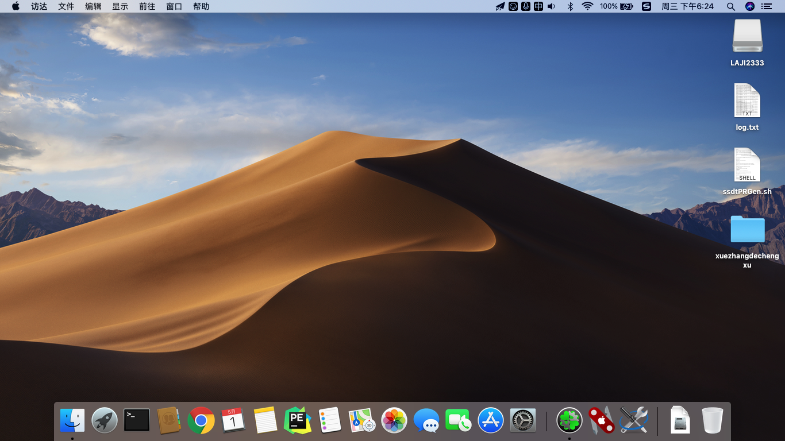
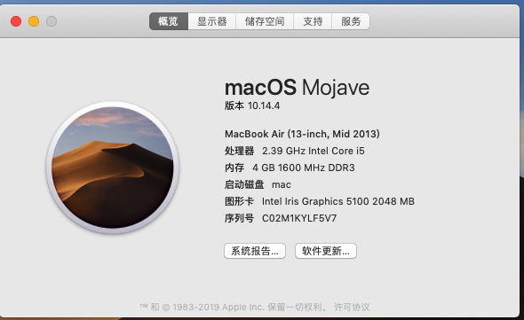
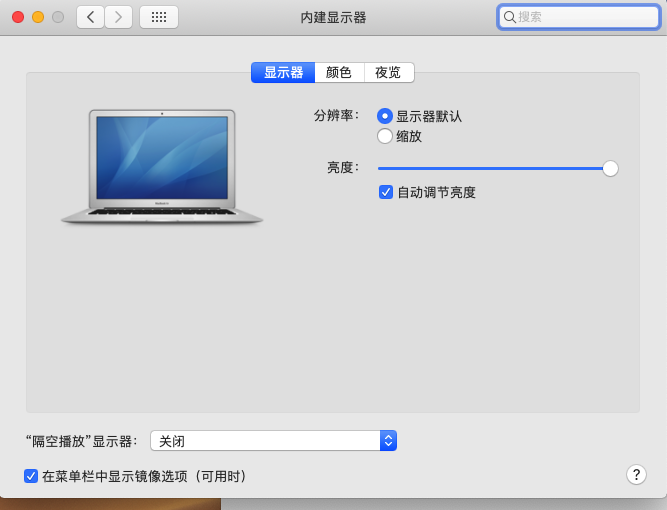
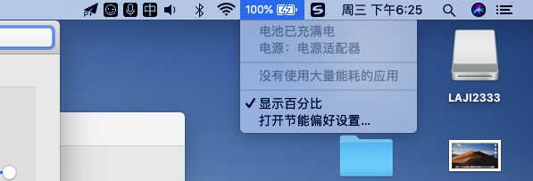
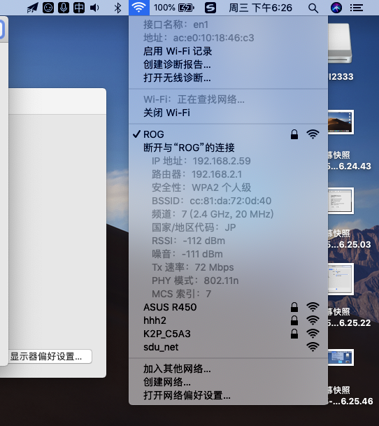
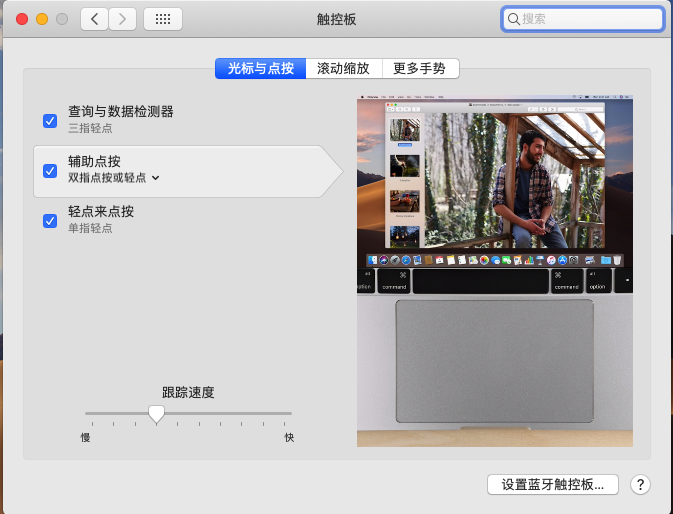
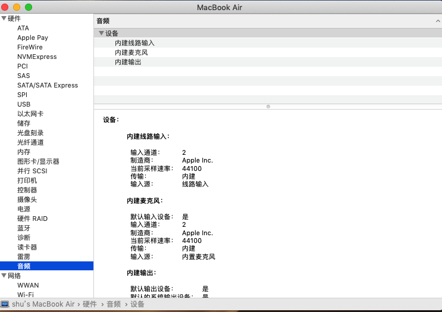
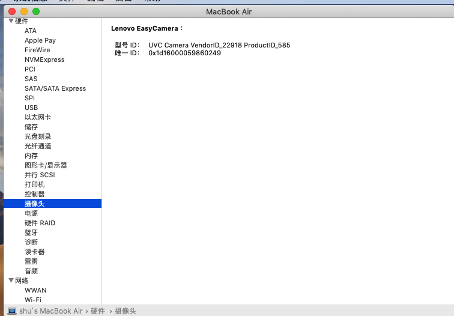
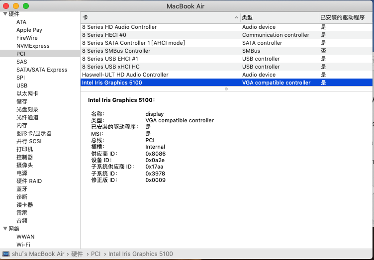

# Lenovo_G40_70M_EFI

# Lenovo G40 70M EFI 黑苹果 HACKINTOSH

# Lenovo_G40_70M EFI for macOS Mojave

这是我使用的 Lenovo_G40_70M 的CLOVER引导文件

### 电脑配置

| 规格     | 详细信息                                                |
| -------- | ----------------------------------------------------- |
| 电脑型号 | Lenovo G40 70M 笔记本电脑                                    |
| 操作系统 | macOS Mojave 18D42                                   |
| 处理器   | 英特尔 Core i5-4258U @ 2.40GHz 双核                   |
| 内存     | 4 GB ( DDR3L 1600MHz )                           |
| 硬盘     | SATA 固态硬盘                        |
| 显卡     | Intel HD Graphics 5100  (platform-id:0x0A2E0006)       |
| 声卡     |  Conexant CX20751 (layout-id:3)              |
| 网卡     | AR9565                     |

### 安装镜像

**将镜像中EFI替换为本仓库的EFI文件夹**

直接使用黑果小兵博客中的镜像进行安装：[【黑果小兵】macOS Mojave 10.14.3 18D42 正式版 with Clover 4859原版镜像](https://blog.daliansky.net/macOS-Mojave-10.14.3-18D42-official-version-with-Clover-4859-original-image.html)

### CLOVER

* 支持Mojave
* CPU原生支持，变频正常（使用`ssdtPRGen.sh`）
* 睡眠唤醒 无效
* 显卡原生支持，采用`Lilu+WhateverGreen`通过`Clover/device/Properties`方式注入
* 声卡为Conexant CX20751 ，使用 `AppleALC` ，layout-id:3，通过`Clover/device/Properties`方式注入
* 无线网卡更换为 `AR9565` 使用仓库的脚本安装驱动
* 显示器亮度调节 `FN F11/F12` 快捷键
* 其它 `ACPI` 补丁修复采用 `hotpatch` 方式，文件位于 `/CLOVER/ACPI/patched`
* 电池`HOTPATCH`补丁显示电池状态正常
* 触摸板单双指手势正常 `VoodooPS2`

### 系统截图

